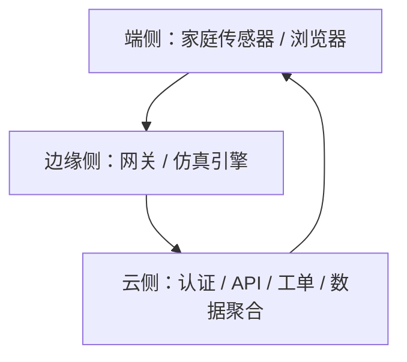

# 云边端部署方案

## 架构说明



- 端侧：住户设备、管理人员浏览器、移动端访问页面
- 边缘侧：模拟器、规则引擎、告警聚合、工单触发
- 云侧：登录认证、统一 API、前端页面、会话管理、数据展示

## 当前项目的推荐部署方式

本项目最适合课程演示的方式是“云端托管前后端 + 边缘逻辑本地仿真”。也就是说：

- 云侧负责页面、登录注册、统一 API 和工单流转
- 边缘侧负责动态仿真与告警生成
- 端侧使用浏览器访问即可

这样既能体现云边端协同，又能保证现场演示稳定。

## 部署步骤

### 1. 云侧部署

在云服务器或宿主机上执行：

```bash
cd /mnt/e/iot
python3 start_community_system.py --host 0.0.0.0 --port 8080
```

如果要对外访问，建议再用 Nginx 做反向代理，把 80/443 转发到 8080。

### 2. 端侧访问

浏览器打开：

```text
http://云服务器IP:8080/login.html
```

登录后进入主系统：

```text
http://云服务器IP:8080/index.html
```

### 3. 边缘侧说明

当前代码中，边缘侧能力已经由 `CommunitySimulator` 和 `CommunityHub` 内置实现，负责：

- 周期性生成住户状态
- 识别燃气、烟雾、过载、漏水和老人低活动异常
- 自动生成工单与通知

如果后续要做“物理拆分”，可以再把边缘侧独立成一台边缘主机，并增加数据上报接口。


## 默认账号

- 账号：`admin@community.local`
- 密码：`Admin@12345`
