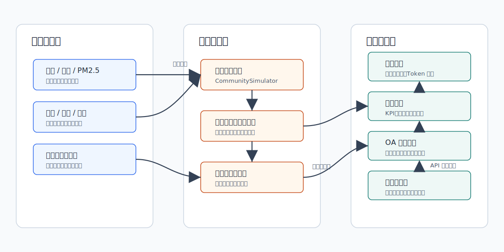
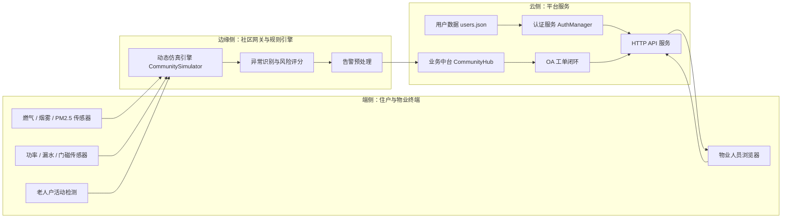
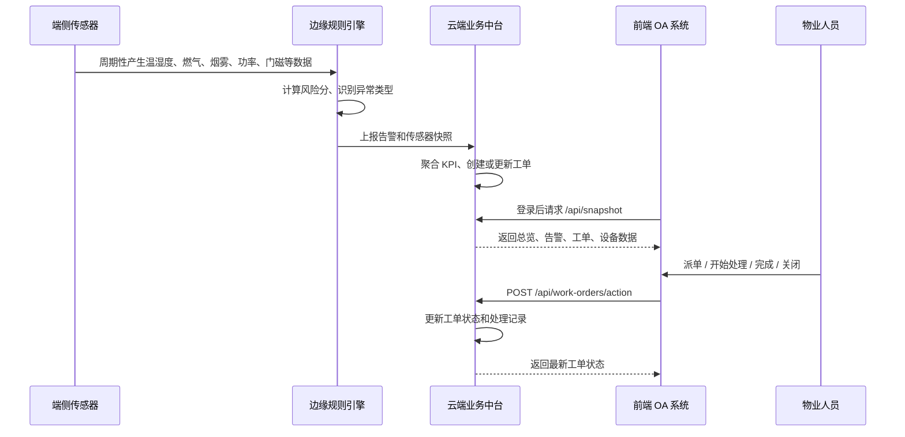
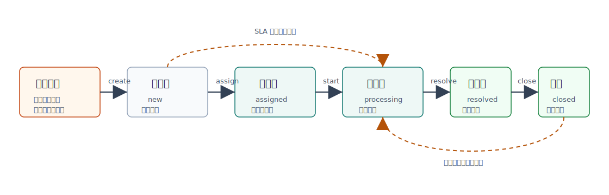
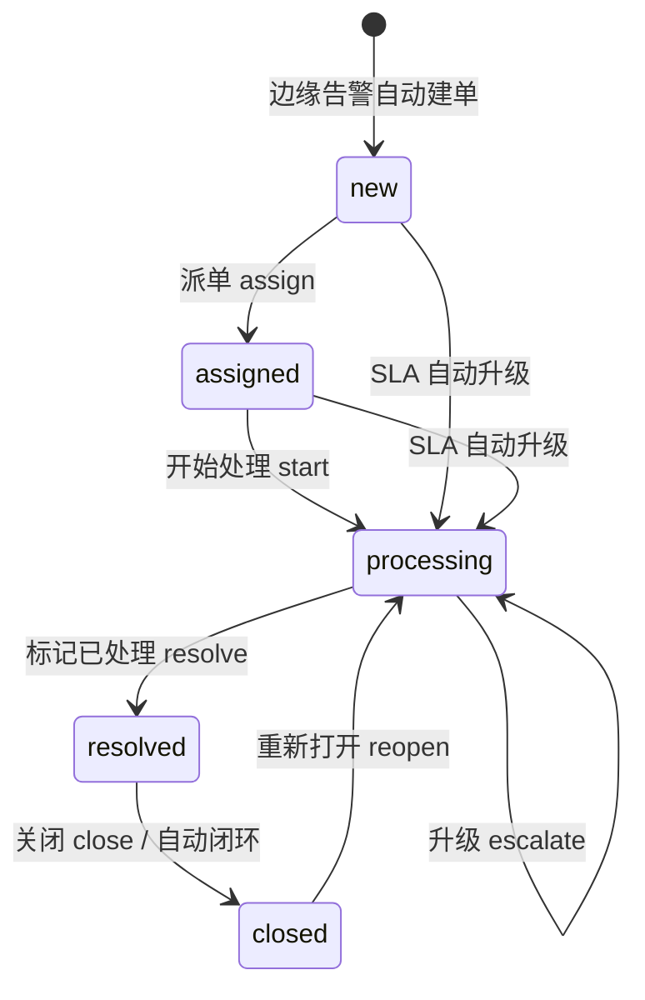

# 物联网技术与应用课程实验报告

## 智慧社区居家安全与能耗协同管理系统

| 项目 | 内容 |
| --- | --- |
| 课程名称 | 物联网技术与应用 |
| 实验题目 | 智慧社区居家安全与能耗协同管理系统设计与实现 |
| 系统类型 | 云边端协同物联网系统 |
| 应用场景 | 老旧社区居家安全监测、能耗治理与物业工单闭环 |
| 前端入口 | `http://127.0.0.1:8080/login.html` |
| 后端入口 | `python3 start_community_system.py --port 8080` |
| 默认账号 | `admin@community.local` |
| 默认密码 | `Admin@12345` |

## 摘要

随着城市社区治理逐渐向精细化、数字化和智能化方向发展，居民居家安全、物业响应效率、社区能耗管理以及特殊人群关怀等问题越来越受到重视。传统社区管理方式主要依赖人工巡查、居民主动报修和物业人员线下处理，这种方式在面对多楼栋、多住户、多设备、多风险事件时容易出现信息滞后、记录分散、责任不清和处置不闭环等问题。尤其在老旧社区中，燃气管线、电气线路、给排水设施、独居老人照护等问题更加复杂，单纯依靠人工经验已经难以满足实时化管理要求。

针对上述问题，本实验设计并实现了一套“智慧社区居家安全与能耗协同管理系统”。系统以真实生活中的居家风险为切入点，围绕燃气泄漏、烟雾异常、空气质量下降、用电过载、漏水隐患、夜间门磁异常以及老人户低活动异常等场景展开设计。项目采用云边端协同架构：端侧模拟多类型住户传感器和物业人员浏览器，边缘侧完成动态数据生成、风险识别和告警预处理，云侧负责登录注册、统一 API、业务数据聚合、工单流转和前端页面服务。系统前后端分离，后端使用 Python 实现动态仿真引擎、规则引擎、业务中台和 HTTP API，前端使用 HTML、CSS、JavaScript 实现标准登录注册、总览驾驶舱、工单看板、告警中心、设备画像、创新展示和系统设置等页面。

与仅展示静态数据的课程项目相比，本系统更强调物联网系统的连续运行特征。系统后端会随时间不断推进模拟状态，住户传感器数据、风险评分、告警、通知和工单状态均会发生动态变化。前端页面定时刷新业务快照，使使用者能够看到数据变化、告警产生、工单流转和系统闭环的全过程。实验结果表明，该系统能够较完整地覆盖物联网课程中端侧感知、边缘计算、云端平台、数据可视化和应用业务闭环等核心内容，具有较好的课程实验完整性、现实应用价值和后续拓展空间。

**关键词：** 物联网；智慧社区；云边端协同；居家安全；能耗管理；边缘计算；工单闭环

## 1. 选题背景

### 1.1 现实背景

智慧社区是物联网技术在城市基层治理中的典型应用场景。社区居民日常生活中存在大量与安全、能耗和服务相关的状态数据，例如厨房燃气浓度、烟雾浓度、室内温湿度、PM2.5、用电功率、漏水状态、门磁状态、住户活动情况等。这些数据原本分散在不同家庭和不同设备中，如果不能被及时采集和关联分析，物业人员往往只能在居民报修或事故发生后被动处理。物联网系统的价值就在于将这些分散的状态数据转化为可感知、可分析、可预警和可追踪的数字化事件，从而提高社区管理的主动性。

在现实生活中，社区居家安全问题通常具有突发性、隐蔽性和连锁性。例如燃气泄漏在早期可能只是浓度轻微升高，但如果没有及时发现和通风处置，可能进一步发展为火灾或爆炸风险；烟雾和 PM2.5 异常可能来自厨房油烟、设备故障或火情前兆；用电过载短期内可能只表现为功率升高，但长期存在会增加线路发热和跳闸风险；漏水问题若未及时发现，可能造成家具损坏、邻里纠纷和公共设施维修成本增加。对于老人户而言，低活动异常并不一定直接等同于危险，但它是值得社区网格人员关注的弱信号，若能及时复核，就能在一定程度上提升社区关怀能力。

传统智慧社区系统虽然已经能够展示一些设备状态，但在实际使用中仍然存在明显不足。许多系统更偏向“看板展示”，缺少从告警到处理的闭环流程；部分系统虽然可以显示传感器数据，但没有结合多源信号形成综合风险判断；也有系统缺少动态数据和真实业务流程，导致演示效果静态、应用价值不足。对于课程实验而言，如果项目只停留在固定数据表和单页面展示，就难以体现物联网系统的实时性、联动性和工程完整性。

因此，本实验选择以“智慧社区居家安全与能耗协同管理”为主题，将居家安全、能源管理、老人关怀和物业工单结合起来，构建一个具有动态数据流、风险识别、工单流转和云边端协同部署思路的综合系统。

### 1.2 选题意义

从课程学习角度看，本课题能够较好地覆盖物联网技术与应用课程中的多个核心知识点。端侧传感器数据建模对应感知层设计，边缘侧规则识别对应边缘计算和局部决策，云侧 API 和业务中台对应平台层设计，前端 OA 系统对应应用层交互。通过完成该项目，可以把课程中的分散知识点串联为一个完整系统，而不仅仅是完成某一个局部功能。

从实际应用角度看，社区居家安全与能耗治理具有较高的现实价值。居民日常生活中的燃气、烟雾、漏水和用电异常都属于高频且高风险问题，若能用物联网系统实现早发现、早提醒、早处置，就可以降低事故发生概率，提高物业服务水平。同时，老人户主动关怀功能也使系统从单纯的设备管理扩展到社区服务，有助于提升智慧社区系统的人文价值。

从工程实现角度看，本项目虽然使用本地仿真方式完成课程演示，但系统架构并没有局限于静态演示。后端的 `CommunitySimulator` 可以视为真实硬件数据源的替代层，后续可进一步替换为 MQTT、HTTP 或串口上报的数据接收模块；当前的 Python HTTP 服务也可以部署到云服务器，并通过 Nginx 或其他网关对外提供访问。因此，本项目既具备课堂演示的可运行性，也具备扩展到真实物联网原型系统的可能。

## 2. 需求分析

### 2.1 用户角色分析

系统面向的不是单一用户，而是社区治理中多个角色共同参与的业务场景。不同角色关注的数据和操作并不完全相同，因此系统需要兼顾总览展示、告警查看、设备查询和工单处理等多个需求。

| 用户角色 | 使用目标 | 主要操作 |
| --- | --- | --- |
| 社区物业管理员 | 查看社区整体安全态势和能耗状态 | 登录系统、查看总览、处理通知、协调工单 |
| 安全巡检人员 | 处理燃气、烟雾、门磁等安全风险 | 接收安全工单、开始处理、标记完成 |
| 电工维护人员 | 处理用电过载和峰值负载问题 | 查看设备功率、处理用电工单、复核风险 |
| 管网维护人员 | 处理漏水和管网异常 | 查看漏水告警、上门排查、闭环处理 |
| 网格服务人员 | 关注老人户低活动异常 | 接收关怀工单、电话回访或上门确认 |
| 系统管理员 | 管理账号和运行状态 | 登录注册、模拟控制、查看 API 状态 |

在实际社区中，物业管理员往往首先需要了解全局态势，因此系统提供总览页和通知中心；维修人员更关注具体工单和设备指标，因此系统提供工单看板和设备画像；系统管理员需要控制演示运行，因此系统提供模拟暂停、继续、手动步进等功能。这样的角色划分使系统功能更贴近真实应用，而不是只为展示数据而展示数据。

### 2.2 功能需求

系统功能需求主要从“用户入口、数据采集、异常识别、业务处置、可视化展示、系统部署”几个方面展开。需求设计时既考虑课程实验的可实现性，也考虑智慧社区场景的真实性。

| 需求编号 | 功能需求 | 实现情况 |
| --- | --- | --- |
| FR-01 | 用户登录和注册 | 已实现 `login.html`、`register.html` 和认证 API |
| FR-02 | 动态生成住户传感器数据 | 已实现 `CommunitySimulator` 动态仿真 |
| FR-03 | 实时计算风险与能耗指标 | 已实现 KPI、趋势、楼栋画像 |
| FR-04 | 多源告警识别 | 已实现燃气、烟雾、用电、漏水、老人关怀、空气质量、夜间门磁识别 |
| FR-05 | 自动生成工单 | 已实现告警到工单自动创建 |
| FR-06 | 工单流转闭环 | 已实现派单、开始处理、完成、关闭、重开、升级 |
| FR-07 | 前端多页面切换 | 已实现总览、工单、告警、设备、创新、设置 |
| FR-08 | 云边端部署说明 | 已形成 `云边端部署方案.md` |
| FR-09 | 受保护接口鉴权 | 已实现 token 鉴权，未登录无法访问核心 API |

这些功能之间存在明确的先后关系。传感器数据是系统运行的基础，风险识别依赖数据变化，告警依赖风险识别，工单依赖告警产生，前端页面则将这些业务对象组织成可操作的界面。登录注册和接口鉴权为系统提供基本访问控制，避免未登录用户直接读取核心业务数据。云边端部署说明则使项目从“本地 demo”进一步扩展为具有部署思路的物联网系统设计。

### 2.3 非功能需求

非功能需求决定了系统是否“像一个真正的系统”。对于本实验而言，除了完成具体功能，还需要关注实时性、可用性、安全性、可维护性、可扩展性和演示性。

| 类型 | 要求 | 设计措施 |
| --- | --- | --- |
| 实时性 | 页面应能持续显示动态变化 | 后端定时推进模拟时间，前端定时刷新快照 |
| 可用性 | 操作流程应符合 OA 系统习惯 | 使用工单看板、详情面板、通知中心 |
| 安全性 | 核心 API 需登录后访问 | 使用 token 会话校验，密码哈希存储 |
| 可维护性 | 模块边界清晰 | 分为 `auth`、`simulator`、`hub`、`server`、`frontend` |
| 可扩展性 | 可继续接入真实硬件 | 边缘仿真模块可替换为真实 MQTT 或 HTTP 数据上报 |
| 演示性 | 适合课堂答辩演示 | 本地 8080 端口一键启动，数据自动变化 |

其中，实时性和演示性是本课程项目的重要要求。如果系统数据完全静态，即使页面设计完整，也难以体现物联网系统“持续感知”的本质。安全性则体现在登录注册和受保护 API 上，这使系统不只是一个公开页面，而是具备了基本平台应用特征。可扩展性主要体现在代码结构上，系统将仿真、业务中台、认证和前端拆分为独立模块，后续替换数据源或增加功能时不会影响全部代码。

## 3. 系统总体设计

### 3.1 总体架构

系统采用云边端三层协同结构。端侧负责数据产生和用户交互，边缘侧负责实时预处理，云侧负责统一管理、接口服务和前端展示。三层之间不是简单的数据转发关系，而是分工协作关系：端侧提供原始状态，边缘侧把原始状态转化为风险事件，云侧把风险事件进一步组织为业务对象，前端再把业务对象呈现给管理人员。





本实验中，端侧传感器由仿真程序模拟，边缘侧和云侧在同一 Python 进程内运行，但逻辑上仍然保持分层。这样设计的原因是：课程实验需要保证部署简单、运行稳定，同时又要体现云边端协同思想。因此，系统在实现上采用轻量化本地部署，在设计说明上保留真实部署时的拆分方式。若部署到真实环境，可以将边缘侧独立到社区网关，将云侧部署到服务器，前端通过浏览器访问云端服务。

### 3.2 技术路线

| 层级 | 技术或模块 | 说明 |
| --- | --- | --- |
| 端侧 | HTML、CSS、JavaScript | 提供登录注册和 OA 风格前端页面 |
| 边缘侧 | `CommunitySimulator`、`CommunityHub._detect_alerts` | 模拟传感器数据并进行规则判断 |
| 云侧 | `ThreadingHTTPServer`、REST API | 提供认证、数据快照、工单动作和模拟控制接口 |
| 数据层 | Python dataclass、JSON 文件 | 定义数据结构，保存用户账号 |
| 可视化 | SVG 图表、页面切换、看板布局 | 展示趋势、告警分布、设备画像和工单状态 |

本项目没有引入复杂框架，而是使用 Python 标准库和原生前端技术完成系统。这样做一方面降低了课程实验部署门槛，另一方面也有利于清晰展示系统核心逻辑。对于物联网课程项目而言，关键并不一定是使用复杂技术栈，而是能够准确表达数据流、业务流和系统分层。本项目通过 `CommunitySimulator` 体现端侧数据变化，通过 `CommunityHub` 体现边缘规则和云端聚合，通过 `server_oa_v2.py` 提供 API，通过前端页面完成可视化和交互闭环。

### 3.3 模块结构

| 文件或目录 | 作用 |
| --- | --- |
| `src/smartcity_iot/models.py` | 定义住户画像、传感器快照、告警、工单、通知等数据模型 |
| `src/smartcity_iot/simulator.py` | 负责动态生成住户状态和传感器数据 |
| `src/smartcity_iot/hub.py` | 负责告警识别、工单创建、KPI 聚合和业务快照 |
| `src/smartcity_iot/auth.py` | 负责注册、登录、密码哈希、token 会话管理 |
| `src/smartcity_iot/server_oa_v2.py` | 提供静态前端托管和 HTTP API |
| `frontend_oa_v2/login.html` | 登录页面 |
| `frontend_oa_v2/register.html` | 注册页面 |
| `frontend_oa_v2/index.html` | 主系统页面 |
| `frontend_oa_v2/app.js` | 主系统前端交互逻辑 |
| `start_community_system.py` | 系统启动脚本 |

模块拆分遵循“数据模型、数据产生、业务处理、接口服务、前端展示”分离的原则。`models.py` 只描述数据结构，不承担业务判断；`simulator.py` 只负责生成状态，不直接处理工单；`hub.py` 作为业务中台，负责把数据转化为告警、通知和工单；`server_oa_v2.py` 则负责把业务能力暴露为 HTTP API。这样的拆分使系统职责清晰，也方便后续对某一层进行替换或扩展。

### 3.4 数据流设计



从数据流可以看出，系统中的数据不是一次性生成后静止不变，而是在每一个模拟周期内不断更新。仿真引擎产生新的住户状态后，边缘规则会立即判断是否存在异常；若触发异常，业务中台会将其写入告警队列，并根据住户和告警类型创建或更新工单。前端并不直接操作传感器数据，而是从云端业务快照中读取聚合结果。这样既降低了前端复杂度，也使系统更符合真实物联网平台“前端看结果、后端管状态、边缘判风险”的设计逻辑。

## 4. 解决方案设计

### 4.1 端侧感知设计

本实验以社区住户为基本单元，为每户模拟多类传感器数据。住户画像中包含楼栋、楼层、住户类型、是否有老人、基础负载、基础温度和基础湿度等信息。这些信息使不同住户之间具有差异性。例如老人户活动规律与普通家庭不同，租户和家庭住户的在家概率不同，不同楼层和住户的基础负载也会有所差异。通过这些差异化参数，仿真数据不再是简单随机数，而是具有一定生活逻辑。

| 指标 | 单位或类型 | 作用 |
| --- | --- | --- |
| `temperature_c` | 摄氏度 | 反映室内温度变化 |
| `humidity_pct` | 百分比 | 反映室内湿度和漏水影响 |
| `gas_ppm` | ppm | 识别燃气泄漏风险 |
| `smoke_ppm` | ppm | 识别烟雾异常 |
| `pm25` | 数值 | 识别空气质量异常 |
| `power_w` | W | 识别用电过载和峰值负载 |
| `water_leak` | 布尔值 | 识别漏水风险 |
| `door_open` | 布尔值 | 识别夜间门磁异常 |
| `motion_count` | 次数 | 识别老人户活动异常 |
| `risk_score` | 0-100 | 作为综合风险评分 |

端侧传感器在当前实验中由仿真引擎模拟，后续可替换为真实硬件，例如 ESP32、燃气传感器、烟雾传感器、功率计量模块和门磁传感器。在真实部署中，端侧设备可以通过 MQTT 将数据发布到边缘网关，边缘网关再按照本实验中的规则逻辑进行预处理。

### 4.2 边缘侧规则引擎设计

边缘侧的核心任务是尽可能靠近数据源进行初步判断，减少云端压力，并提升告警响应速度。对于燃气泄漏、烟雾异常等安全事件，等待所有原始数据上传到云端再处理可能会增加响应延迟；而在边缘侧先进行规则判断，可以在第一时间生成告警并触发本地提醒。即使本项目以本地仿真实现，仍然按照边缘规则引擎的思路组织代码。

| 告警类型 | 判断依据 | 工单处理组 |
| --- | --- | --- |
| 燃气泄漏 | 燃气浓度过高或短时间突增 | 安全巡检组 |
| 烟雾超标 | 烟雾浓度、PM2.5 或烟雾增量异常 | 消防联动组 |
| 用电过载 | 实时功率过高或功率突增 | 电工维护组 |
| 漏水告警 | 漏水传感器持续触发 | 管网维护组 |
| 老人关怀 | 老人户在有人状态下长时间低活动 | 网格服务组 |
| 夜间门磁 | 夜间无人状态下门磁开启 | 安保值班组 |
| 空气质量 | PM2.5 持续偏高 | 环境治理组 |

规则设计不是简单地把某个指标超过阈值就判定为异常，而是结合当前值、变化量和住户属性进行判断。例如燃气浓度既考虑绝对值过高，也考虑短时间突增；用电过载既考虑实时功率，也考虑功率变化量；老人关怀则需要同时满足“住户有老人”“当前有人”“连续多个周期低活动”等条件。这样的设计能够减少误报，使系统更接近真实业务判断逻辑。

为了避免同一住户同一类型告警在短时间内反复刷屏，系统加入冷却机制，同类告警需间隔一定 tick 后才会再次进入告警流。冷却机制在物联网系统中非常重要，因为传感器数据会高频上报，如果没有抑制策略，同一异常可能在短时间内生成大量重复事件，反而降低管理人员对告警的关注度。

### 4.3 云侧业务中台设计

云侧主要由 `CommunityHub` 和 `server_oa_v2.py` 构成。业务中台负责保存最新住户数据、聚合全局 KPI、维护告警队列、维护通知队列、维护趋势数据、将边缘告警转换为工单、根据 SLA 自动升级工单，并对外提供统一数据快照。

云侧设计的核心思想是将“原始数据”加工为“业务视图”。前端并不需要直接关心每一个传感器的计算细节，也不需要自己判断哪些住户风险最高、哪些工单最紧急。业务中台将原始传感器快照、风险评分、告警、通知、楼栋画像和工单状态统一组织成 `/api/snapshot` 返回的业务快照。前端只需定时获取该快照，就可以刷新页面中的所有视图。

这种设计具有两个优点。第一，前后端职责清晰，前端主要负责展示和交互，后端负责业务判断和数据聚合。第二，后续扩展更方便，如果需要增加新的传感器类型或风险规则，只需要在后端模型和规则中扩展，再把结果放入快照即可，前端可以逐步增加展示模块。

### 4.4 前端 OA 系统设计

前端采用多页面切换方式，整体风格类似物业 OA 管理系统。系统没有采用单纯大屏展示，而是把总览、工单、告警、设备、创新和设置拆分为不同页面，使用户能够按照任务场景进入对应功能区。

| 页面 | 功能 |
| --- | --- |
| 登录页 | 用户输入账号密码并获取 token |
| 注册页 | 创建新账号 |
| 总览页 | 展示 KPI、趋势图、告警类型图、楼栋画像、通知中心 |
| 工单页 | 看板式展示工单流转状态，并支持派单、处理、闭环 |
| 告警页 | 展示告警统计和实时告警列表 |
| 设备页 | 按风险、能耗、楼栋查看住户设备状态 |
| 创新页 | 展示项目针对传统智慧社区缺陷的改进点 |
| 设置页 | 控制仿真运行、查看 API 说明 |

总览页适合管理人员快速了解整体态势，工单页适合具体处置，告警页适合追踪异常来源，设备页适合排查具体住户状态，创新页则用于课程答辩展示项目特色。这样的页面结构不仅便于使用，也能在实验报告和课堂演示中清晰说明系统功能边界。

## 5. 关键代码实现

### 5.1 用户认证与会话管理

系统在 `auth.py` 中使用 PBKDF2 对密码进行哈希处理，并使用随机 token 维护登录会话。该设计避免明文保存密码，同时使核心 API 可以基于 token 进行访问控制。虽然本项目是课程实验，但加入认证模块能够使系统更接近真实应用。对于智慧社区管理系统而言，住户状态、告警和工单都属于敏感业务数据，不应允许未登录用户直接访问。

```python
def _hash_password(self, password: str, *, salt: bytes | None = None) -> str:
    salt_bytes = salt or os.urandom(16)
    digest = hashlib.pbkdf2_hmac(
        "sha256",
        password.encode("utf-8"),
        salt_bytes,
        200_000,
    )
    return (
        f"pbkdf2_sha256$"
        f"{base64.b64encode(salt_bytes).decode()}$"
        f"{base64.b64encode(digest).decode()}"
    )
```

该代码使用随机盐值和 PBKDF2-HMAC-SHA256 算法生成密码摘要。随机盐值可以避免相同密码得到相同哈希结果，迭代计算可以提高暴力破解成本。系统最终保存的是哈希值，而不是原始密码。

登录成功后，系统生成随机 token 并设置过期时间：

```python
token = secrets.token_urlsafe(32)
expires_at = datetime.utcnow() + timedelta(hours=self.session_hours)
self._sessions[token] = SessionInfo(
    token=token,
    username=user["username"],
    email=user["email"],
    expires_at=expires_at,
)
```

token 的作用是让前端在后续请求中证明当前用户已经登录。相比每次都传输用户名和密码，token 方式更符合 Web 系统常见会话管理方式。当前实验中 token 保存在内存会话表中，用户信息保存到 `data/users.json`，既满足本地实验使用，也便于观察和调试。

### 5.2 受保护 API 鉴权

在 `server_oa_v2.py` 中，服务端从请求头读取 `Authorization: Bearer <token>`，并在访问核心业务 API 前调用 `_require_auth()`。该设计使静态页面、登录注册接口和业务数据接口之间形成明确边界。

```python
def _auth_token(self) -> str:
    auth_header = self.headers.get("Authorization", "").strip()
    if auth_header.lower().startswith("bearer "):
        return auth_header[7:].strip()
    return self.headers.get("X-Auth-Token", "").strip()

def _require_auth(self) -> dict[str, str] | None:
    user = self._current_user()
    if not user:
        self._json({"ok": False, "message": "未登录或登录已过期"}, status=HTTPStatus.UNAUTHORIZED)
        return None
    return user
```

对于快照接口，必须登录后才能访问：

```python
if parsed.path == "/api/snapshot":
    if not self._require_auth():
        return
    self._json(self.server.hub.snapshot())
    return
```

这样处理后，未登录用户即使知道 API 地址，也只能获得 401 响应，无法直接读取业务数据。前端在收到 401 后会清除本地 token 并跳转登录页，从而形成完整的前后端认证闭环。

### 5.3 动态仿真数据生成

系统没有使用固定数据表，而是通过 `CommunitySimulator` 随时间推进动态生成每户状态。仿真过程考虑用餐时间、住户类型、是否有人、空调和热水器等日常行为，使数据具有更强的动态感。

```python
def step(self) -> tuple[list[TelemetrySnapshot], datetime]:
    self.tick_index += 1
    self.sim_time += timedelta(minutes=self.step_minutes)
    self._inject_periodic_challenge()
    hour = self.sim_time.hour + self.sim_time.minute / 60
    snapshots: list[TelemetrySnapshot] = []
    for profile in self.profiles:
        snapshots.append(self._simulate_unit(profile, self.runtime[profile.unit_id], hour))
    return snapshots, self.sim_time
```

在每次 `step()` 中，系统会推进模拟时间，并为每一个住户生成新的传感器快照。`_inject_periodic_challenge()` 用于周期性注入燃气、漏水、过载或烟雾等风险事件，使系统在演示时能够持续出现可观察的异常，而不是一直保持平稳状态。

风险分通过多源指标综合计算：

```python
risk_score = (
    8.0
    + max(0.0, gas_ppm - 16.0) * 1.7
    + max(0.0, smoke_ppm - 28.0) * 0.82
    + max(0.0, pm25 - 90.0) * 0.2
    + max(0.0, power_w - 3000.0) * 0.01
    + (30.0 if water_leak else 0.0)
    + (12.0 if door_incident else 0.0)
    + (12.0 if profile.has_elderly and runtime.motion_silence_ticks >= 6 else 0.0)
)
```

该评分方法体现了多源融合思想。燃气、烟雾、空气质量、功率、漏水、门磁和老人低活动都会影响最终风险值。风险分不是单一指标，而是多个信号共同作用的结果。前端设备页可以据此对住户进行风险排序，物业人员也可以优先关注风险较高的住户。

### 5.4 告警识别与自动建单

边缘规则引擎识别到异常后，会将异常转换为告警，并进一步创建或更新工单。该过程体现了从“数据异常”到“业务事件”的转换。

```python
if current.gas_ppm >= 24 or (current.gas_ppm >= 18 and delta_gas >= 8):
    severity = min(5, 3 + int((current.gas_ppm - 20) / 8))
    specs.append((
        "gas_leak",
        severity,
        "疑似燃气泄漏",
        f"{current.unit_id} 燃气浓度 {current.gas_ppm} ppm，存在泄漏或明火风险。",
        "建议开启通风、关闭阀门并派安全巡检组复核。",
    ))
```

燃气告警规则同时考虑绝对浓度和变化趋势。如果浓度已经明显偏高，系统会直接触发告警；如果浓度尚未达到极高水平，但短时间内上升明显，系统也会认为存在风险。这比单一阈值判断更加符合安全监测的实际需求。

自动建单的核心逻辑如下：

```python
order = WorkOrder(
    order_id=order_id,
    unit_id=snapshot.unit_id,
    building_id=snapshot.building_id,
    kind=kind,
    severity=severity,
    title=title,
    description=recommendation,
    status="new",
    assignee=ASSIGNEE_MAP.get(kind, "综合运维组"),
    priority=PRIORITY_MAP.get(severity, "P2"),
    created_at=snapshot.timestamp,
    updated_at=snapshot.timestamp,
    due_at=due_at.isoformat(timespec="seconds"),
    progress_pct=8,
    history=[{"actor": "EdgeEngine", "action": "create", "note": "边缘规则引擎自动建单。"}],
)
```

工单中包含住户编号、楼栋、异常类型、严重程度、标题、处理建议、状态、处理组、优先级、创建时间、截止时间、进度和历史记录等信息。这些字段使工单不只是一个提示消息，而是可以被追踪、派发、处理和复核的业务对象。

### 5.5 工单流转与闭环

系统支持工单从新建到关闭的全过程。状态机设计如下：





工单流转设计的意义在于把“发现问题”与“解决问题”连接起来。许多传统系统只停留在告警展示层面，管理人员看到异常后仍需手动记录、转发和追踪。本系统将告警自动转化为工单，并通过状态机约束处理流程，使每个异常都有明确的处理阶段和历史记录。

工单操作由 `apply_order_action` 统一处理，并记录历史：

```python
allowed = {
    "assign": {"new", "assigned"},
    "start": {"assigned", "new"},
    "resolve": {"processing", "assigned"},
    "close": {"resolved", "processing"},
    "reopen": {"closed", "resolved"},
    "escalate": {"new", "assigned", "processing"},
}
```

该状态约束避免了不合理操作，例如已经关闭的工单不能直接标记完成，待派单工单不能直接关闭。系统还支持 SLA 自动升级，如果工单超过规定时间仍未处理，会自动推进状态或提高严重程度。这种设计使系统更接近真实物业管理平台。

### 5.6 前端登录态与 API 请求

前端登录成功后将 token 存入 `localStorage`，访问核心 API 时自动加入请求头：

```javascript
async function apiFetch(url, options = {}) {
  const headers = new Headers(options.headers || {});
  const token = getToken();
  if (token) {
    headers.set('Authorization', `Bearer ${token}`);
  }

  const response = await fetch(url, {
    cache: 'no-store',
    ...options,
    headers,
  });

  if (response.status === 401) {
    clearSession();
    redirectToLogin();
    throw new Error('未登录或登录已过期');
  }

  return response;
}
```

这一段逻辑使主前端不需要在每个请求中重复处理 token，只要通过统一的 `apiFetch` 方法发送请求即可。若会话过期，前端会自动跳转到登录页，避免用户停留在已经失效的页面中继续操作。对于课程演示而言，该设计也使登录、鉴权、跳转和业务访问形成了完整闭环。

## 6. 系统功能实现

### 6.1 登录与注册

系统提供标准登录和注册页面。登录页面展示默认演示账号，注册页面支持用户名、邮箱、密码和确认密码输入。后端对用户名、邮箱格式、密码长度和重复账号进行校验。

| 页面 | 文件 | 说明 |
| --- | --- | --- |
| 登录页 | `frontend_oa_v2/login.html` | 登录后进入主系统 |
| 注册页 | `frontend_oa_v2/register.html` | 注册成功后跳转登录页 |
| 认证脚本 | `frontend_oa_v2/auth.js` | 调用登录、注册和会话校验 API |
| 认证服务 | `src/smartcity_iot/auth.py` | 管理账号、密码哈希和 token |

登录注册模块的作用不仅是增加一个页面入口，更重要的是把系统从开放式展示页提升为具有平台属性的管理系统。真实智慧社区平台通常涉及住户信息、告警记录和工单记录，因此必须区分已登录用户和未登录用户。本项目通过登录态控制核心 API 访问，使系统完整性更强。

### 6.2 总览驾驶舱

总览页面集中展示住户数、安全评分、开放工单、今日能耗、平均风险、当前通知等关键指标，并提供风险与能耗趋势图、告警类型分布图和楼栋画像。该页面用于快速判断社区整体运行状态。

总览页的设计重点是“快速判断”。物业管理员在日常工作中不可能逐户查看所有传感器，因此系统将大量底层数据聚合为少量 KPI。例如安全评分可以反映社区整体风险水平，开放工单数量可以反映当前工作压力，今日能耗可以反映社区用能情况，告警类型分布可以提示当前主要风险来源。通过这些指标，管理人员可以先形成总体判断，再进一步进入工单或设备页面排查细节。

### 6.3 工单流转

工单页面采用看板式布局，将工单分为待派单、已派单、处理中、待闭环等状态。用户点击工单后可以在右侧详情面板查看标题、住户、楼栋、风险等级、处理建议、进度和历史记录，并执行对应动作。

该页面是系统最能体现 OA 业务价值的部分。工单看板可以让用户直观看到每个阶段的任务数量，详情面板可以避免列表信息过于拥挤，操作按钮则根据当前状态动态呈现。这样既保证了页面信息密度，也让工单处理流程清晰可控。

### 6.4 告警中心

告警中心按类型展示燃气、烟雾、过载、漏水、老人关怀、夜间门磁、空气质量等告警统计，并支持点击告警联动到对应工单。

告警中心的重点是解释“为什么会有工单”。工单体现的是处理任务，告警体现的是风险来源。通过告警中心，用户可以从类型、严重程度和住户位置角度理解当前风险结构。例如若短时间内用电过载类告警增加，说明可能需要关注高峰负载或线路隐患；若老人关怀类告警增加，则说明网格人员需要优先复核相关住户。

### 6.5 设备画像

设备页面按住户展示温度、湿度、功率、燃气、烟雾、PM2.5、门磁、漏水、能耗和风险状态。用户可以按关键词、风险等级和排序方式筛选设备。

设备画像页面用于支撑细粒度排查。当某个楼栋或某类告警出现异常时，管理人员可以进入设备页查看具体住户状态，判断异常是否来自单一指标、多个指标叠加，或是否与住户类型有关。风险排序功能可以帮助用户优先查看高风险住户，避免在大量设备中手动查找。

### 6.6 创新模块

项目针对传统智慧社区系统的常见缺陷设计了三项创新：

| 创新点 | 针对缺陷 | 实现方式 | 价值 |
| --- | --- | --- | --- |
| 多源告警关联闭环 | 告警孤立、只报不管 | 将多源传感器数据统一到住户风险上下文，自动建单闭环 | 降低漏判，提高响应效率 |
| 分时能耗画像 | 只统计总能耗，缺少精细分析 | 结合实时功率、功率突增和趋势数据识别峰值负载 | 支持节能治理和过载排查 |
| 弱势住户主动关怀 | 忽视老人等弱势群体 | 对老人户低活动异常生成关怀工单 | 提升社区服务温度 |

创新模块的意义在于说明本项目并非简单复刻常见智慧社区看板，而是针对传统系统不足提出了改进方向。多源告警关联强调技术联动，分时能耗画像强调精细治理，老人户主动关怀强调社区服务温度。三者分别对应安全、节能和民生三个维度，使系统更具有完整应用价值。

## 7. 云边端部署方案

### 7.1 本地实验部署

本地启动命令如下：

```bash
cd /mnt/e/iot
python3 start_community_system.py --port 8080
```

浏览器访问：

```text
http://127.0.0.1:8080/login.html
```

本地部署方式适合课程实验和课堂答辩。系统启动后，后端会自动启动动态仿真线程，前端通过浏览器访问即可完成登录、查看和工单操作。由于不依赖外部数据库和复杂部署环境，该方式稳定性较高，便于展示项目效果。

### 7.2 云边端实际部署设想

| 层级 | 部署位置 | 部署内容 |
| --- | --- | --- |
| 云侧 | 云服务器或学校服务器 | Web 页面、登录注册、业务 API、工单管理、数据聚合 |
| 边缘侧 | 社区网关、物业本地服务器或边缘盒子 | 传感器接入、规则判断、告警预处理、缓存 |
| 端侧 | 住户设备和物业终端 | 传感器采集、浏览器访问、工单处理 |

云侧可通过如下命令绑定到外部可访问地址：

```bash
python3 start_community_system.py --host 0.0.0.0 --port 8080
```

若部署在公网服务器上，可使用 Nginx 将 80 或 443 端口反向代理到 8080，以便使用域名访问。边缘侧当前由仿真模块实现，后续接入真实硬件时，可以将 `CommunitySimulator.step()` 替换为 MQTT、HTTP 或串口上报的数据接收逻辑。

真实部署时，端侧设备可以布置在住户厨房、配电箱、卫生间或入户门附近，负责采集燃气、烟雾、功率、漏水和门磁等数据；边缘网关部署在小区物业机房或楼栋弱电箱中，负责接收设备数据并执行快速规则判断；云端平台部署在服务器上，负责长期数据存储、账号管理、工单管理和跨终端访问。这样的部署方式既能保证本地异常快速响应，又能让物业人员通过统一平台查看全局数据。

## 8. 测试与运行结果

### 8.1 测试环境

| 项目 | 内容 |
| --- | --- |
| 操作系统 | 本地 Windows / WSL 环境 |
| 后端语言 | Python 3 |
| 前端技术 | HTML、CSS、JavaScript |
| 服务端口 | 8080 |
| 数据来源 | 动态仿真生成 |

测试环境采用本地运行方式，重点验证系统能否从启动、登录、数据刷新、告警生成到工单处理形成完整闭环。由于项目本身不依赖外部服务，测试过程主要关注后端服务是否正常启动、核心 API 是否按预期返回、未登录请求是否被拦截，以及前端页面是否能够根据快照数据动态刷新。

### 8.2 功能测试

| 测试项 | 测试方法 | 预期结果 | 结果 |
| --- | --- | --- | --- |
| 系统启动 | 执行启动脚本 | 服务运行并显示登录地址 | 通过 |
| 未登录访问快照接口 | 请求 `/api/snapshot` | 返回 401 未登录 | 通过 |
| 默认账号登录 | 输入默认账号密码 | 登录成功并进入主系统 | 通过 |
| 用户注册 | 输入合法用户名、邮箱、密码 | 注册成功并跳转登录页 | 通过 |
| 快照获取 | 登录后请求 `/api/snapshot` | 返回 KPI、工单、告警、设备数据 | 通过 |
| 工单操作 | 点击派单、处理、完成等动作 | 工单状态变化并记录历史 | 通过 |
| 自动刷新 | 保持页面打开 | 图表和数据持续变化 | 通过 |

测试结果说明系统的主要业务链路已经打通。未登录访问快照接口返回 401，说明鉴权逻辑生效；默认账号登录成功和用户注册成功说明认证流程可用；登录后获取快照说明前端与后端数据贯通；工单状态变化说明业务中台能够正确处理前端动作；自动刷新说明系统具备动态演示能力。

### 8.3 API 测试说明

| API | 方法 | 是否鉴权 | 说明 |
| --- | --- | --- | --- |
| `/api/auth/register` | POST | 否 | 注册账号 |
| `/api/auth/login` | POST | 否 | 登录并返回 token |
| `/api/auth/me` | GET | 是 | 查询当前用户 |
| `/api/auth/logout` | POST | 是 | 退出登录 |
| `/api/snapshot` | GET | 是 | 获取业务快照 |
| `/api/sim/control` | POST | 是 | 控制模拟暂停、继续、步进 |
| `/api/work-orders/action` | POST | 是 | 执行工单动作 |

API 设计遵循前后端分离思想。认证类接口负责登录、注册和会话管理，业务类接口负责数据快照、模拟控制和工单操作。前端页面不直接读取本地文件，也不直接访问后端内部对象，而是通过 HTTP API 与后端交互，这使系统更接近真实 Web 应用。

## 9. 社会价值

### 9.1 提升社区安全治理能力

系统针对燃气泄漏、烟雾异常、用电过载、漏水和门磁异常等高频风险进行实时监测和联动处置，能够帮助物业人员更早发现隐患，缩短响应时间，降低事故发生概率。尤其在老旧小区中，线路老化、燃气设施老化和管网问题较为常见，系统化监测能够弥补人工巡查频次有限的问题。

### 9.2 提高物业服务效率

传统物业处理问题往往依赖电话、微信群或人工登记，流程不透明、责任难追踪。本系统将告警自动转化为工单，并记录派单、处理、完成和闭环过程，使社区运维从“人找问题”转向“系统驱动处置”。这不仅提高了处置效率，也使后续复盘和责任追踪更加清晰。

### 9.3 促进节能减排

系统对实时功率、今日能耗和高峰负载进行分析，可用于识别异常高耗能住户或设备，为社区节能管理、线路负载优化和居民用能提醒提供依据。若后续结合真实电表数据，还可以进一步扩展为分户能耗分析、峰谷用电建议和异常耗电设备识别。

### 9.4 增强弱势群体关怀

老人户低活动异常识别使系统不再只是关注设备指标，而是将社区关怀纳入数字化流程。对独居老人或行动不便居民而言，低活动异常提醒可以促使网格员及时电话回访或上门确认，使智慧社区系统更具人文价值。

## 10. 总结与讨论

本实验围绕智慧社区这一真实应用场景，完成了一套具有动态数据、前后端分离、登录注册、云边端协同、告警识别、工单闭环和多页面可视化能力的物联网系统。相比单纯静态数据展示，本项目更能体现物联网系统连续感知、实时分析和业务联动的特点。

项目的主要成果包括：

- 实现了动态仿真引擎，使住户状态和传感器数据随时间持续变化。
- 实现了边缘规则引擎，可识别多类居家安全和能耗异常。
- 实现了云端业务中台，将告警、工单、KPI、趋势和通知统一聚合。
- 实现了标准登录注册和 token 鉴权，提高了系统完整性。
- 实现了 OA 风格前端系统，支持多页面切换和工单闭环。
- 提出了多源告警关联、分时能耗画像、老人户主动关怀三项创新优化。

从设计过程看，本项目最大的特点是围绕“业务闭环”组织功能。传感器数据本身只是系统输入，真正产生价值的是数据经过规则判断后形成告警，再经过工单系统进入处理流程。这样的设计使系统不只是一个展示平台，而是具备了初步的管理平台能力。

从实现过程看，项目在轻量化和完整性之间进行了平衡。后端没有引入复杂框架，而是使用 Python 标准库实现 HTTP 服务和线程运行，降低了环境依赖；前端采用原生 HTML、CSS 和 JavaScript 实现多页面交互，便于理解和修改；认证、仿真、业务聚合和前端展示则保持相对独立，使代码结构清晰。

同时，系统仍有进一步完善空间。当前传感器数据主要通过仿真生成，后续可以接入真实硬件设备；当前用户权限相对简单，后续可以增加管理员、维修人员、网格员等多角色权限；当前数据主要保存在内存和 JSON 文件中，后续可以接入 SQLite、MySQL 或时序数据库；当前通信方式以 HTTP 为主，后续可以引入 MQTT 以更贴近真实物联网设备上报方式。

总体来看，本实验较完整地覆盖了物联网课程中端侧感知、边缘计算、云端平台、应用系统和社会价值等核心内容，具备较好的课程展示效果和实际应用拓展价值。通过该项目，可以更加直观地理解物联网系统并不是简单地把传感器数据搬到网页上，而是要围绕真实问题构建从感知到处置的完整链路。

## 参考资料

1. 项目源码：`/mnt/e/iot/src/smartcity_iot`
2. 前端页面：`/mnt/e/iot/frontend_oa_v2`
3. 启动说明：`/mnt/e/iot/启动说明-智慧社区系统.md`
4. 云边端部署方案：`/mnt/e/iot/云边端部署方案.md`

